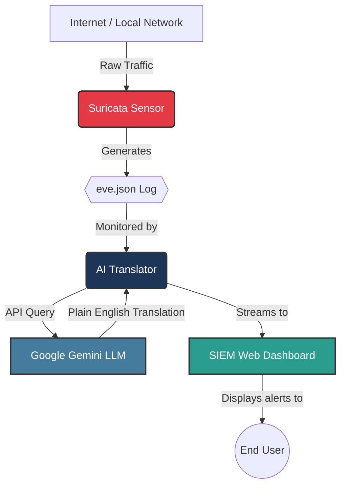

# ClearDetect SIEM

[](https://www.python.org/downloads/)
[](https://www.docker.com/)
[](https://flask.palletsprojects.com/)
[](https://opensource.org/licenses/MIT)

> **Project Goal:** Make enterprise-grade security simple and accessible by combining Suricata with an LLM-powered alert translation layer.

## Overview

In traditional security, enterprise tools like Security Information and Event Management (SIEM) systems output highly complex, technical logs. Understanding these logs usually requires a dedicated, full-time security team, which leaves small businesses unprotected.

Rather than reinventing a proven intrusion detection engine, ClearDetect builds on **Suricata** and focuses on solving a different problem: making security alerts understandable to non-technical users. When Suricata generates an alert, the AI translation service monitors the alert stream, converts the technical event into plain English, and provides actionable remediation guidance via a clean web dashboard.

## Project Architecture

### Visual Flow



The repository contains three main components working together in a unified Docker architecture:

1. **Suricata Network Sensor**: 
   - Sits at the network edge and sniffs incoming traffic.
   - Outputs highly technical JSON telemetry alerts (`eve.json`) when it detects malicious signatures.
2. **AI Translator (`eai_translator.py`)**: 
   - A Python microservice that continuously monitors the Suricata log file in real-time.
   - Integrates Google's Gemini Large Language Model to dynamically analyze and translate highly technical security alerts into human-readable text.
3. **SIEM Dashboard**: 
   - A dark-theme, Kibana-inspired web interface built with Flask and plain JavaScript. 
   - Subscribes to the AI Translator to stream translated cyber alerts live to the browser.

## Core Features

- **Suricata Integration**: Powered by an industry-standard, signature-based IDS engine.
- **LLM-Powered Alert Translation**: Uses Google Gemini to convert complex cyber threats into plain English dynamically.
- **Offline Fallback**: Built-in NLP heuristics guarantee the system continues to work even if the API rate limits or loses connectivity.
- **Simple Deployment**: Entirely Dockerized. No complex configurations or dependency hell.
- **Kibana-Style Dashboard**: A sleek, professional dark-theme SIEM interface optimized for readability and rapid threat monitoring.

## Technologies Used

- **Backend**: Python Flask
- **AI Integration**: Google Gemini API (`google-generativeai`)
- **Network IDS**: Suricata
- **Containerization**: Docker Compose
- **Frontend**: HTML5, CSS, Vanilla JavaScript

## How to Run Locally

### Prerequisites
Make sure you have **Docker Desktop** installed and running on your system. You will also need a free **Google Gemini API Key** (from Google AI Studio).

### Setup Steps

1. **Clone the repository:**
   ```bash
   git clone https://github.com/rakesh-pathuri/ClearDetect-SIEM.git
   cd ClearDetect-SIEM
   ```

2. **Configure API Key:**
   Copy the example environment file and add your Gemini API key:
   ```bash
   cp .env.example .env
   ```
   *Open the `.env` file and replace `your_api_key_here` with your real key.*

3. **Deploy the Architecture:**
   *ClearDetect is built to be simple to deploy and use. Deploy the orchestrated stack with a setup command:*
   ```bash
   docker compose up --build -d
   ```

4. **Access the Dashboard:**
   Open your web browser and navigate to **`http://localhost:8080`**.

### Testing the System

To verify that the Suricata sensor is actively sniffing traffic and the AI engine is translating it, you can trigger a live alert.

1. **Run the Test Script:**
   Open a terminal and run the provided test batch file:
   ```bash
   test_alert.bat
   ```

   *This script forces the Suricata Docker container to ping a known malicious test URL (`testmyids.com`). You will instantly see the resulting translated alert populate on your Live Threat Stream dashboard.*

> **Note:** AI-generated explanations are intended to improve readability and should complement, not replace, professional security analysis.

---

### Open Source Credits

This project relies on the excellent work of the Open Information Security Foundation (OISF) and the Suricata community. Their continued development and maintenance of Suricata make projects like this possible.

### Authorship
**Developed by:** Rakesh Pathuri
*Built to make enterprise security simple and accessible for Small and Medium Enterprises (SMEs).*
